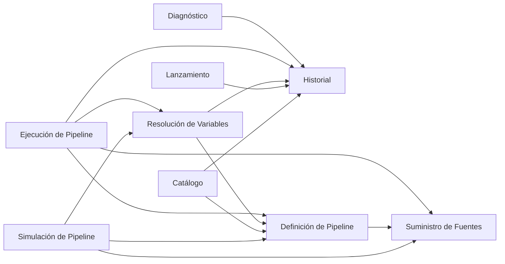

# Bounded Contexts — Motor de Vex

> **Espacio de la solución.** Dónde acaba cada modelo y por qué. Qué es cada subdominio está en
> `dominio.md`; cómo se habla dentro de cada contexto, en `lenguaje.md`.
>
> **Vigente** desde el cierre de IT-03 (2026-09-13). Si contradice a un documento de
> `iteraciones/`, manda éste. El patrón de cada relación está en `context-map.md`.

---

## Cómo se decide una frontera

**Una sola prueba** (IT-03 `DEC-03.1`): hay frontera entre X e Y si, al cruzar, un término
**significa otra cosa** u **obedece otras reglas**. Que se pierda información al cruzar no basta, y
llevar contenido sin interpretarlo no crea frontera. Cada prueba se escribe así:

> Al cruzar de X a Y, «T» deja de significar S₁ (u obedecer R₁) y pasa a significar S₂ (u obedecer
> R₂). Si X e Y se fusionaran, las dos convivirían dentro del mismo contexto.

Tres reglas más:

- **Un contexto por subdominio** es el ideal en un proyecto que empieza de cero, y un contexto puede
  realizar más de uno. La carga de la prueba está del lado de **fusionar** (`DEC-03.2`).
- **Cada contexto se llama como su subdominio**; si realiza dos, como aquel cuyo modelo es
  (`DEC-03.14`).
- **Dos contextos que no se hablan son distintos**: la prueba solo se aplica a los pares que se
  cruzan.

Volatilidad, facilidad de prueba y tamaño **no** son criterio (IT-01, H5).

---

## El mapa: ocho contextos

| Contexto | Realiza | Tipo | Propósito |
|---|---|---|---|
| **Diagnóstico** | Diagnóstico | Core | Nombrar la causa de un fallo comparando sobre tres ejes, dentro de un ambiente y entre ambientes, solo con hechos |
| **Definición de Pipeline** | Definición de Pipeline | Supporting | Declarar cómo se despliega un producto y comprobar que lo escrito está bien formado y bien referenciado |
| **Historial** | Historial · Sincronización del Historial | Supporting · Generic | Conservar como registros todo lo que pasó (intentos, despliegues, lanzamientos) y tenerlo disponible en cualquier máquina |
| **Lanzamiento** | Lanzamiento | Supporting | Decidir cuándo un despliegue se hace visible y con qué nombre |
| **Catálogo** | (consulta) | Supporting | Dar a conocer qué ambientes (y si están reservados) y qué pasos tiene un pipeline |
| **Ejecución de Pipeline** | Ejecución de Pipeline | Supporting | Llevar a cabo un intento re-ejecutando solo los pasos en los que algo cambió |
| **Resolución de Variables** | Resolución de Variables | Supporting | Determinar el valor efectivo de cada variable y saber si cambió, sin exponerlo |
| **Simulación de Pipeline** | Simulación de Pipeline | Supporting | Recorrer un pipeline entero sin efectos para saber si funciona antes de publicarlo |
| **Suministro de Fuentes** | Suministro de Fuentes | Generic | Poner delante el código y el pipeline, como están hoy o como estaban, y saber si cambiaron |

**Lo que no es contexto:**

- **Sincronización del Historial.** Sigue siendo un subdominio Generic, pero en la solución es cómo
  el Historial está disponible en otra máquina. Llevar registros sin interpretarlos no es cruzar a
  otro modelo (`DEC-03.11`).
- **Decidir / Planificación del Intento.** Decidir y hacer se intercalan paso a paso, y ningún
  término cambia entre una cosa y la otra. Separarlas es trabajo táctico de E9 (`DEC-03.4`).

---

## Quién habla con quién

Una flecha dice que el origen **usa** algo del destino: lee de él o le pide que guarde algo. La
dirección es siempre la de quien llama. Los patrones están en `context-map.md`.

| De | A | Qué usa |
|---|---|---|
| Diagnóstico | Historial | despliegues, intentos, cantidad de intentos, evidencia, pasos y lanzamientos (como puerta de entrada), más lo que el Historial guarda de otros contextos: hashes y el orden de los ambientes con que se desplegó |
| Ejecución | Definición | pasos, comandos, y las formas de *regla*, de *variable de salida* y de *aserción* |
| Ejecución | Resolución | valores, interpolación y si cambiaron las variables de un paso · a cambio le entrega lo que producen los comandos |
| Ejecución | Suministro | el material de hoy o de un commit · hash del código y commit |
| Ejecución | Historial | la última vez de cada paso, la evidencia y el destino de un rollback · a cambio deja los registros del intento |
| Resolución | Definición | variables declaradas con su ámbito, y las formas de *ámbito* y de *variable de salida* |
| Resolución | Historial | hash de variable y valor de la última vez · a cambio deja el hash de variable y el valor ofuscado |
| Lanzamiento | Historial | el despliegue que se lanza · a cambio deja el registro del lanzamiento |
| Catálogo | Definición · Historial | los ambientes y los pasos del pipeline, en su orden · la última reserva de un ambiente |
| Definición | Suministro | el pipeline como fuente |
| Simulación | Definición · Resolución · Suministro | comprobación y pasos · interpolación · material |

**Tres ausencias que son decisiones:**

- **El core solo lee el Historial** (`DEC-03.3`).
- **Simulación no lee el historial ni habla con Ejecución** (`DEC-03.10`).
- **Suministro no habla con el Historial.** Lo que el Historial guarda de Suministro se lo lleva
  Ejecución.

---

## Los contextos

### Diagnóstico · *core*

**Propósito.** Nombrar la causa de un fallo (código, instrucciones o variables) comparando sobre
tres ejes, dentro de un ambiente y entre ambientes, solo con hechos.

**Términos propios.** causa · sustento · eje · eliminación · atribución · deducción · inferencia ·
orden de los ambientes *(su significado)*.

**Consume, todo del Historial.** despliegue · intento · cantidad de intentos · evidencia · paso ·
lanzamiento · hash del código · hash de las instrucciones de un paso · hash de
variable.

**Pruebas de separación.**

| Vecino | Prueba |
|---|---|
| Historial | Al cruzar del Historial a Diagnóstico, *registro* deja de ser un hecho de un paso y de un intento que ya no cambia, y pasa a ser el material del que se deriva el **estado de un eje** (cambió o no) entre el intento que falla y un despliegue de referencia: depende de qué referencia se elija y solo existe mientras dura la comparación. Fusionados, dentro de un modelo de hechos inmutables habría estados derivados que cambian con cada consulta |

**Sin cruce** con los otros seis: todo lo que le prometen le llega ya conservado en el Historial.

---

### Definición de Pipeline · *supporting*

**Propósito.** Declarar cómo se despliega un producto (igual en todos los ambientes, salvo sus
variables) y comprobar que lo escrito está bien formado y bien referenciado.

**Términos propios.** pipeline *(la declaración)* · paso *(el declarado)* · comando · instrucciones ·
variable declarada · ambiente · comprobación · y cinco **formas declaradas**: ámbito · regla ·
variable de salida · aserción · orden de los ambientes.

**Consume.** El pipeline como fuente, de Suministro.

**Pruebas de separación.**

| Vecino | Prueba |
|---|---|
| Ejecución | *Paso* deja de ser un nombre con una lista de comandos, igual en todos los ambientes, y pasa a ser la unidad que en un intento se ejecuta o no se re-ejecuta. *Regla* deja de ser algo escrito y pasa a ser una decisión con resultado. Fusionados, el mismo paso sería a la vez invariable y distinto en cada intento |
| Resolución | *Variable* deja de ser un literal escrito en un ámbito y pasa a ser un valor efectivo, tras aplicar precedencia y ámbito. *Ámbito* deja de ser lo escrito y pasa a decidir qué ve un paso. Fusionados, convivirían lo escrito y lo vigente |
| Suministro | *Pipeline* deja de ser un repositorio con hash y commits, cuyo contenido no se interpreta, y pasa a ser una declaración con variables, pasos y ambientes. Fusionados, la misma palabra nombraría el contenido y el envoltorio |
| Simulación | *Variable de salida* deja de ser un nombre con una expresión regular y pasa a tener una **salida simulada** que la cumple y que nadie produjo. Fusionados, la declaración contendría valores inventados |

**Sin cruce con Diagnóstico**: el orden de los ambientes le llega a través del Historial.

---

### Historial · *supporting*, y realiza Sincronización del Historial *(generic)*

**Propósito.** Conservar como registros todo lo que pasó (intentos, despliegues y lanzamientos) y
tenerlo disponible en cualquier máquina.

**Términos propios.** registro · historial · intento *(el hecho)* · estado · sin desenlace · despliegue · padre ·
punto de retorno · lanzamiento *(el registro)* · reserva *(el registro)* · cantidad de intentos ·
evidencia · paso *(la posición)* · declaración congelada · solicitante · sincronizar · despliegue
registrado.

**Su regla de fondo** (`DEC-03.13`): **la forma es suya; lo que dice cada registro es de quien lo
produjo**. Guarda sin aplicarles sus reglas:

- de Ejecución: la razón de no re-ejecutar un paso y el hash de las instrucciones de un paso;
- de Resolución: el hash de variable y el valor, ofuscado;
- de Suministro: el hash del código, el del pipeline y el commit;
- de Lanzamiento: la versión y el nombre;
- de Definición: el orden de los ambientes con que se desplegó.

Y **ofusca lo que guarda**, porque es quien persiste. El valor ofuscado no forma parte de lo que
publica: solo vuelve a Resolución (IT-04 `DEC-04.7`).

**Pruebas de separación.**

| Vecino | Prueba |
|---|---|
| Diagnóstico | La de Diagnóstico, en sentido inverso |
| Ejecución | *Intento* deja de ser algo que se está llevando a cabo, que puede fallar a mitad o cancelarse, y pasa a ser un hecho con un estado que ya no cambia. Fusionados, el mismo intento sería mutable e inmutable a la vez |
| Resolución | *Hash de variable* deja de calcularse y compararse y pasa a guardarse sin compararse; el *valor* deja de estar en claro y pasa a estar ofuscado, sin que nadie lo lea. Fusionados, la memoria sabría comparar variables y leer valores |
| Lanzamiento | *Lanzamiento* deja de ser una decisión, con actor, nombre y la regla del actor ausente, y pasa a ser un registro que conoce su despliegue y el lanzamiento anterior. Fusionados, las reglas del actor ausente vivirían dentro de la memoria, donde pierden (IT-01 `DEC-01.13`) |

**Por qué Sincronización no es un contexto aparte.** No comparte ningún término con el Historial ni
aplica reglas sobre lo que lleva: lo mueve sin interpretarlo. Con la prueba elegida, eso no es
frontera (`DEC-03.11`).

---

### Lanzamiento · *supporting*

**Propósito.** Decidir cuándo un despliegue se hace visible y con qué nombre. Un lanzamiento puede
ocurrir **en cualquier ambiente** (`DEC-03.17`).

**Términos propios.** lanzar · lanzamiento *(la decisión)* · destinatario · reserva *(la decisión)* ·
fecha de publicación · versión · nombre del lanzamiento.

**Consume.** El despliegue que se lanza, del Historial.

**Pruebas de separación.**

| Vecino | Prueba |
|---|---|
| Historial | La del Historial, en sentido inverso |

Lanzar es hacer visible un despliegue **a quien usa ese ambiente**. El dueño del negocio decide donde
él elija, y en el resto se lanza solo al quedar listo (IT-04 `DEC-04.1`). Se entera escuchando
*despliegue registrado*, que publica el Historial (`DEC-04.8`), y consultando la última **reserva** del
ambiente (`DEC-04.9`).

---

### Ejecución de Pipeline · *supporting*

**Propósito.** Llevar a cabo un intento re-ejecutando solo los pasos en los que algo cambió, y dejar
dicho qué se hizo y por qué.

**Términos propios.** intentar · intento *(en curso)* · ejecución *(el acto)* · paso *(el que se
ejecuta)* · re-ejecución de un paso · no se re-ejecuta · recursos de un paso · hash de las
instrucciones de un paso · regla *(su significado)* · variable *(el valor)* · variable de salida *(la
producida)* · rollback · destino · aislamiento · espacio de trabajo.

**Consume.**

- de Definición: pasos, comandos, y las formas de regla y de variable de salida;
- de Resolución: valores, interpolación, y si cambiaron las variables de un paso;
- de Suministro: el material de hoy o de un commit, el hash del código y el commit;
- del Historial: la última vez de cada paso, la evidencia y los despliegues a los que se puede
  volver.

**Pruebas de separación.**

| Vecino | Prueba |
|---|---|
| Definición | La de Definición, en sentido inverso |
| Historial | La del Historial, en sentido inverso |
| Resolución | *Variable* deja de ser un valor que entra en un comando y no se conserva, y pasa a ser un valor efectivo que se resuelve con precedencia, se convierte en hash y se guarda ofuscado. *Variable de salida* deja de ser lo que se extrae de la salida de un comando y pasa a ser un valor con origen «producido por un paso» que entra en la precedencia. Fusionados, Ejecución manejaría el valor y su hash, con reglas opuestas, bajo una sola palabra |
| Suministro | *Fuente* deja de ser un repositorio con historia (hashes y commits) y pasa a ser un **recurso de un paso**: el material fijo con el que se hace este intento. Fusionados, el intento tendría delante toda la historia del repositorio en vez de un punto concreto de ella |

**Sin cruce con Simulación**, y por eso son distintos: allí un paso se recorre siempre, y aquí se
ejecuta o no se re-ejecuta.

---

### Resolución de Variables · *supporting*

**Propósito.** Determinar con qué valor concreto se despliega cada variable en este ambiente y saber
si cambió, **sin que el valor circule**.

**Términos propios.** variable *(el valor efectivo)* · ámbito *(su significado)* · precedencia ·
origen · variable de salida *(el valor producido)* · interpolación · hash de variable.

**Sus reglas.** Es el **único** sitio donde nace un hash de variable. El valor solo está en claro
aquí y en el comando que se ejecuta. En el Historial queda ofuscado, y solo Resolución lo pide de
vuelta.

**Consume.**

- de Definición: variables declaradas, y las formas de ámbito y de variable de salida;
- de Ejecución: lo que producen los comandos;
- del Historial: el hash y el valor de la última vez.

**Pruebas de separación.**

| Vecino | Prueba |
|---|---|
| Definición · Ejecución · Historial | Las de esos contextos, en sentido inverso |
| Simulación | Una **salida simulada**, un valor inventado, cruza a Resolución como un valor producido por un paso en una petición **sin intento**: se interpola, pero no se le calcula hash ni deja rastro. Fusionados, *inventado* pasaría a ser una clase de valor efectivo, y un hash de variable podría nacer de algo que nadie produjo (IT-04 `DEC-04.10`) |

---

### Simulación de Pipeline · *supporting*

**Propósito.** Recorrer un pipeline entero, sin efectos y sin guardar nada, para saber si funciona
antes de publicarlo.

**Términos propios.** simulación *(la entidad)* · simular un comando · salida simulada.

**Sus reglas.**

- No lee el historial y recorre siempre todos los pasos.
- Ninguna salida simulada llega al historial ni al core.
- Para Resolución, una simulación es una **petición sin intento**: interpola, no deja nada en el
  historial y no sabe que las salidas simuladas son inventadas (IT-04 `DEC-04.10`).

**Consume.**

- de Definición: la comprobación, los pasos y las formas;
- de Resolución: la interpolación;
- de Suministro: el material.

**Pruebas de separación.**

| Vecino | Prueba |
|---|---|
| Definición · Resolución | Las de esos contextos, en sentido inverso |
| Suministro | *Fuente* deja de ser un repositorio con historia y pasa a ser el material fijo de una simulación, que no deja rastro. Fusionados, recorrer sin efectos tendría delante la historia entera del repositorio |

**Sin cruce con Ejecución**, y por eso son distintos.

---

### Suministro de Fuentes · *generic*

**Propósito.** Poner delante el código y el pipeline, como están hoy o como estaban en un commit, y
saber si cambiaron.

**Términos propios.** fuente · pipeline *(una fuente)* · hash *(del código y del pipeline)* · commit.

**Pruebas de separación.**

| Vecino | Prueba |
|---|---|
| Definición · Ejecución · Simulación | Las de esos contextos, en sentido inverso |

**No habla con el Historial ni con el core.** Lo que entrega, Ejecución lo deja en el Historial:
es el mismo patrón que el hash (`DEC-03.12`).

---

## Homónimos entre contextos

La tabla vive en `lenguaje.md`. Cada entrada nombra los contextos entre los que cambia de significado
y es, por tanto, una de las pruebas de arriba dicha desde el lenguaje.
