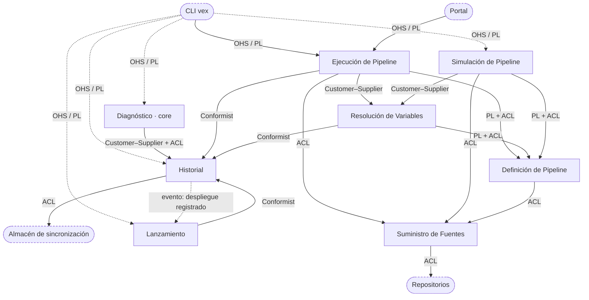

# Context Map — Motor de Vex

> **Espacio de la solución.** Cómo se relacionan los contextos de `bounded-contexts.md`: quién
> manda en cada relación, con qué patrón y qué cruza la frontera.
>
> **Vigente** desde el cierre de IT-04 (2026-09-13). Si contradice a un documento de `iteraciones/`,
> manda éste.

---

## Cómo se lee

- **Upstream (U)** es el contexto cuyo modelo manda en la relación. **Downstream (D)** es el que lo
  usa. La flecha va de D a U: *quién llama → a quién*.
- **Los patrones son los de Vernon** (`guia-ddd.md` §3). Con un solo desarrollador, los patrones de
  organización no describen equipos: describen **qué modelo cede cuando el otro necesita algo**
  (`DEC-04.2`).
  - **Customer–Supplier**: lo que necesita D entra en el modelo de U.
  - **Conformist**: D adopta el modelo de U sin traducirlo.
  - **ACL**: D traduce el modelo de U al suyo, y nada de U entra sin pasar por esa traducción.
  - **Published Language**: un lenguaje compartido y versionado que usan varios.
  - **Open Host Service (OHS)**: U publica un servicio pensado para varios clientes.
  - **Separate Ways**: se decide no integrar.
  - **Evento de dominio**: un hecho que U anuncia sin saber quién lo escucha. En el diagrama es una
    línea punteada que va de quien publica a quien escucha, y **no** cambia el sentido de la relación.
- **Regla del plan**: el core dicta lo que los supporting publican.
- **Lo que publica el Historial son registros sin valores**, tanto hacia los contextos como hacia
  fuera. El valor ofuscado de una variable solo vuelve a Resolución (`DEC-04.7`).

---

## El mapa

**Sin ciclos.** Las llamadas solo bajan:

- Diagnóstico y Lanzamiento → Historial.
- Ejecución → Definición, Resolución, Suministro e Historial.
- Resolución → Definición e Historial.
- Simulación → Definición, Resolución y Suministro.
- Definición → Suministro.

Historial y Suministro son hojas. Que el Historial *guarde* contenido de otros no crea dependencia
hacia ellos, porque no lo interpreta (`DEC-03.13`). Y que Ejecución *entregue* a Resolución lo que
producen los comandos es una operación de Resolución, no una dependencia en sentido contrario. El
evento *despliegue registrado* va del Historial a Lanzamiento, pero no es una llamada: el Historial no
sabe quién lo escucha.

---

## Relaciones entre contextos

| # | Downstream → Upstream | Patrón | Qué cruza | Por qué este patrón |
|---|---|---|---|---|
| 1 | **Diagnóstico → Historial** | **Customer–Supplier + ACL** | registros (intentos, despliegues, lanzamientos, evidencia) con el contenido que guardan de otros: hashes | Es el core. Lo que necesita decide qué conserva el Historial y por qué claves se busca (Customer–Supplier; el hash del código es una, `DEC-07.6`), y nunca adopta el modelo de registros: lo traduce a estado de ejes (ACL, `DEC-03.3`) |
| 2 | **Ejecución → Historial** | **Conformist** a la forma | la forma: intento, paso, evidencia, padre (el *destino* de un rollback se registra como padre) · el contenido de Ejecución (razón, hash de las instrucciones de un paso) viaja opaco | La forma es del Historial y quien escribe la adopta; el contenido no se traduce porque nadie lo interpreta al guardarlo (`DEC-03.13`) |
| 3 | **Resolución → Historial** | **Conformist** a la forma, más una **relación reservada** para el valor | el hash de variable, colocado bajo paso e intento · el **valor ofuscado** va y vuelve **solo** por esta relación | La forma es del Historial, igual que en la #2. El valor no forma parte de lo que el Historial publica: solo se le entrega a Resolución (`DEC-04.7`) |
| 4 | **Lanzamiento → Historial** | **Conformist** a la forma, y **escucha el evento** *despliegue registrado* | el aviso de cada despliegue nuevo · la última reserva del ambiente · el despliegue que se lanza · los registros de lanzamiento y de reserva, con versión y nombre como contenido | Igual que la #2. El Historial anuncia y Lanzamiento decide si lanza en nombre del actor ausente. Nadie llama a Lanzamiento, así que lanzar no es un efecto del despliegue (`DEC-04.8`) |
| 5 | **Ejecución → Resolución** | **Customer–Supplier** | Ejecución pide valores, interpolación y *¿cambiaron las variables de este paso?*, y entrega lo que producen los comandos | Es la frontera más transitada: Resolución publica lo que Ejecución necesita y nada más. Solo aquí cruzan valores en claro (`DEC-03.5`) |
| 6 | **Simulación → Resolución** | **Customer–Supplier** | interpolación en una **petición sin intento**, incluidos los valores producidos por pasos (las salidas simuladas) | Simulación pide algo que Ejecución no pide: interpolar sin dejar rastro. Resolución lo atiende como una petición sin intento, sin hash ni registro, y no sabe que esos valores son inventados (`DEC-04.10`) |
| 7 | **Ejecución → Definición** | **Published Language + ACL** | pasos, comandos, y las formas de regla y de variable de salida | El pipeline es el lenguaje que escribe el DevOps: compartido por tres contextos y con su propia versión. Como las formas significan en quien las aplica (`DEC-03.6`), cada consumidor traduce |
| 8 | **Resolución → Definición** | **Published Language + ACL** | variables declaradas, y las formas de ámbito y de variable de salida | Igual que la #7 |
| 9 | **Simulación → Definición** | **Published Language + ACL** | comprobación, pasos y formas | Igual que la #7 |
| 10 | **Ejecución → Suministro** | **ACL** | material de hoy o de un commit, hash del código y commit → recursos de un paso | *Fuente* cambia de significado al cruzar (una historia frente a un punto fijo), y Suministro es genérico: lo de fuera no entra sin traducir |
| 11 | **Simulación → Suministro** | **ACL** | material → material fijo de una simulación | Igual que la #10 |
| 12 | **Definición → Suministro** | **ACL** | un repositorio → una declaración | Es el homónimo *pipeline*: convertir el contenido de una fuente en pipeline es lo que hace Definición |
| — | **Simulación · Ejecución** | **Separate Ways** | nada | No se hablan (`Q-03.26`). Comparten poco mecanismo propio, porque interpolación y comprobación ya las consumen los dos de otro contexto, y un Shared Kernel ataría dos contextos que no se necesitan (`DEC-04.6`) |

---

## Relaciones con sistemas externos

| Sistema | Relación | Patrón | Qué cruza |
|---|---|---|---|
| **CLI `vex`** y **portal** | piden cosas al motor | **Open Host Service + Published Language** del motor, en español y versionado; el CLI y el portal se adaptan a él (`DEC-04.4`) | intentar hasta un paso en un ambiente · rollback a un destino (Ejecución) · simular (Simulación) · lanzar, y reservar o liberar un ambiente (Lanzamiento) · preguntar la causa (Diagnóstico) · consultar el historial, **sin valores**, y dar por abandonado un intento (Historial) |
| **Almacén de sincronización** | el Historial lo usa para estar disponible en otra máquina | **ACL dentro del Historial** | registros, sin interpretar. Lo comprado queda detrás de la traducción |
| **Repositorios** | Suministro los usa | **ACL dentro de Suministro** | contenido y commits. Lo comprado queda detrás de la traducción |

**Fuera del mapa**: las especificaciones de qué entra en cada hash. Describen técnica, no un lenguaje
de dominio (IT-02 `DEC-02.18`, `DEC-04.5`).

