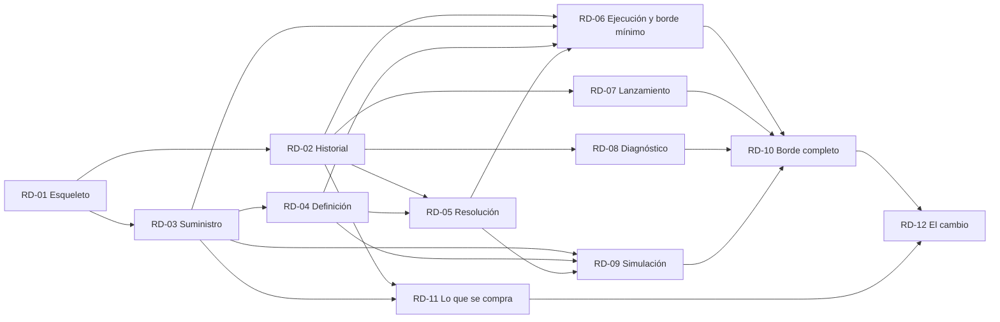

# Catálogo del rediseño — Motor de Vex

> **Entregable de E12** (`iteraciones/IT-12-catalogo.md`). Traduce el modelo cerrado (`modelo/`) a
> unidades que se pueden implementar una a una, en el orden de `modelo/migracion.md`.
>
> **Vigente** desde el cierre de IT-12 (2026-09-14). Lo que el código descubra al implementar va al §9 de
> cada ficha. Si contradice al modelo, se corrige el modelo.

---

## Cómo se lee una ficha

Cada unidad es un archivo `RD-NN-<enunciado>.md` con las mismas secciones:

| § | Qué dice |
|---|---|
| Cabecera | contexto, de qué unidades depende y qué criterio del frente 2 de `DEC-01.10` cumple |
| §1 Problema | qué falta hoy en el motor nuevo |
| §2 Por qué importa | qué se rompe o qué no se puede hacer sin esta unidad |
| §3 Objetivo | qué tiene que ser verdad al terminarla |
| §4 Alternativas | qué otras formas había y por qué se descartan |
| §5 Solución | qué se construye, capa por capa (`arquitectura.md`) |
| §6 Alcance | qué entra y qué queda fuera |
| §7 Verificación | cómo se sabe que está terminada |
| §8 Decisiones | las `DEC-` del modelo que implementa |
| §9 Hallazgos al implementar | **vacío hasta implementarla**: lo que el código descubra y contradiga del modelo |

**Cuándo está terminada una unidad**: compila, pasan sus pruebas, pasa la regla de dependencias sobre los
paquetes nuevos, y su §9 recoge lo que se descubrió al implementarla.

---

## El grafo

**Sin ciclos**: cada flecha va de un número menor a uno mayor, así que el orden 01 → 12 respeta todas las
dependencias.

---

## Las unidades

| # | Ficha | Contexto | Depende de | Qué deja funcionando | Frente 2 |
|---|---|---|---|---|---|
| 01 | `RD-01-esqueleto.md` | — | — | el árbol, la raíz `cmd/motor/` y la regla de dependencias en la integración continua | B |
| 02 | `RD-02-historial.md` | Historial | 01 | la memoria: cinco agregados, almacén local con las tres garantías y el evento *despliegue registrado* | B |
| 03 | `RD-03-suministro.md` | Suministro de Fuentes | 01 | traer una fuente de hoy, de un commit o de una copia de trabajo, con su hash | A |
| 04 | `RD-04-definicion.md` | Definición de Pipeline | 03 | el Pipeline comprobado | B |
| 05 | `RD-05-resolucion.md` | Resolución de Variables | 02, 04 | las variables de un intento, la interpolación y el hash simple | B |
| 06 | `RD-06-ejecucion.md` | Ejecución de Pipeline | 02, 03, 04, 05 | **primer corte de punta a punta**: intentar y hacer rollback en local | A, B, C |
| 07 | `RD-07-lanzamiento.md` | Lanzamiento | 02 | lanzar en nombre del actor ausente, reservar y la versión | B |
| 08 | `RD-08-diagnostico.md` | Diagnóstico *(core)* | 02 | preguntar la causa, ES-1 a ES-8 | B, C |
| 09 | `RD-09-simulacion.md` | Simulación de Pipeline | 03, 04, 05 | simular, con su informe | B |
| 10 | `RD-10-borde.md` | Borde | 06, 07, 08, 09 | todas las operaciones del lenguaje publicado | A |
| 11 | `RD-11-lo-que-se-compra.md` | Historial · Suministro | 02, 03 | el almacén y el acceso a repositorios comprados, detrás de sus ACL | D |
| 12 | `RD-12-el-cambio.md` | — | 10, 11 · **y el CLI y el portal adaptados** | el motor nuevo sustituye al antiguo | A |

**Frente 2 de `DEC-01.10`**: **A** baja acoplamiento medible · **B** fuerza una regla por construcción ·
**C** simplifica un test · **D** se puede revertir tocando un solo contexto.

**Diagnóstico** es el core, y puede empezar en paralelo con RD-03 a RD-07 usando historiales de prueba
(`DEC-11.4`).

---

## Reglas comunes a todas las unidades

- **El árbol y la regla de dependencias** de `arquitectura.md`. El código antiguo vive en `old-internal/`
  hasta RD-12. El comando corre sobre `./...`, lo ignora y rechaza que el código nuevo lo importe (RD-01 §9).
- **Nada del código antiguo** se importa, se adapta ni se toca (`DEC-11.1`, `DEC-11.2`).
- **Identificadores en español, sin tildes** (`DEC-02.2`, `DEC-05.7`). En inglés, solo lo que Go impone:
  los métodos de las interfaces de la biblioteca estándar (`Error()`, `String()`) y los prefijos de las
  pruebas (`Test…`) (`DEC-12.3`).
- **Pruebas** (`DEC-11.3`): las invariantes, con pruebas unitarias del dominio; los escenarios, con
  pruebas de los servicios de aplicación sobre adaptadores en memoria.

---

## Estado

| Unidad | Estado |
|---|---|
| RD-01 | **implementada** en local (2026-09-14). La CI corre cuando se suba |
| RD-02 a RD-12 | pendiente |
